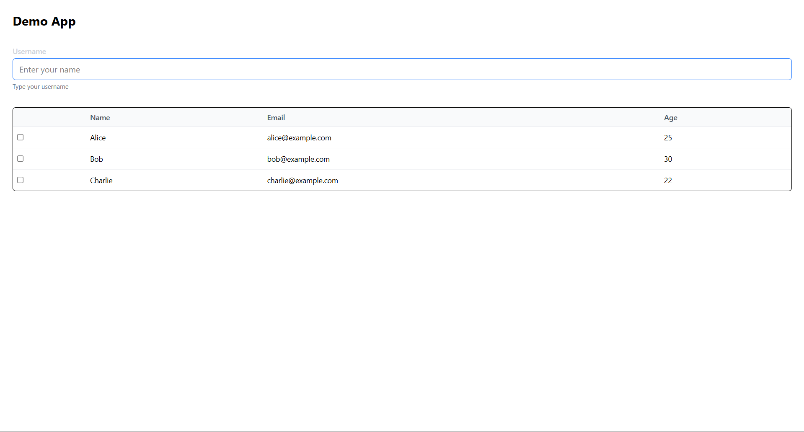

# 🚀 Assignment 1 - Reusable UI Components

This project demonstrates **two reusable UI components** built with **React + TypeScript + TailwindCSS**:

1. **InputField** – a flexible text input with label, placeholder, helper text, and error state.  
2. **DataTable** – a simple, responsive data table with optional row selection and sorting.  

Both components are showcased in a small demo app.

---

## 📸 Demo



The demo app renders:
- A **username InputField**  
- A **DataTable** listing sample users (Name, Email, Age) with selection checkboxes.  

---

## 🛠️ Tech Stack
- [React 18](https://react.dev/) + [Vite](https://vitejs.dev/)  
- [TypeScript](https://www.typescriptlang.org/)  
- [Tailwind CSS](https://tailwindcss.com/)  
- [clsx](https://github.com/lukeed/clsx) for conditional styling  
- [Storybook](https://storybook.js.org/) for component previews  
- [Vitest](https://vitest.dev/) for testing  

---

## 📂 Project Structure
src/ <br/>
├─ components/ <br/>
│ ├─ InputField/ <br/>
│ │ ├─ InputField.tsx <br/>
│ │ ├─ InputField.stories.tsx <br/>
│ │ └─ InputField.test.tsx <br/>
│ ├─ DataTable/ <br/>
│ │ ├─ DataTable.tsx <br/>
│ │ ├─ DataTable.stories.tsx <br/>
│ │ └─ DataTable.test.tsx <br/>
│ └─ types/ <br/>
|   ├─ DataTable.ts <br/>
|   └─ InputField.ts <br/>
├─ App.tsx <br/>
└─ main.tsx

└─ main.tsx


---

## ▶️ Getting Started

### 1. Install dependencies
```bash
npm install
```

### 2. Run the app

```bash
npm run dev

```
Visit: http://localhost:5173

### 3. Run Storybook
```bash
npm run storybook
```

### 4. Run tests
```bash
npm run test
```

# 🧩 Usage Examples

### InputField
```ts
<InputField
  label="Username"
  placeholder="Enter your name"
  helperText="Type your username"
  size="lg"
/>
```
### DataTable
```ts
const columns = [
  { key: "name", title: "Name", dataIndex: "name", sortable: true },
  { key: "email", title: "Email", dataIndex: "email" },
  { key: "age", title: "Age", dataIndex: "age", sortable: true },
];

const data = [
  { name: "Alice", email: "alice@example.com", age: 25 },
  { name: "Bob", email: "bob@example.com", age: 30 },
  { name: "Charlie", email: "charlie@example.com", age: 22 },
];

<DataTable
  data={data}
  columns={columns}
  selectable
  onRowSelect={(rows) => console.log("Selected:", rows)}
/>
```
--- 
# ✅ Features

InputField

Label, placeholder, helper text

Error + disabled states

Size variants (sm, md, lg)

DataTable

Tabular data display

Optional column sorting

Row selection (single/multiple)

Loading + empty states

Responsive design

Accessible (ARIA labels)

---

# 📘 Deliverables

Two reusable components (InputField, DataTable)

Storybook previews

Basic unit tests

Demo app integration


